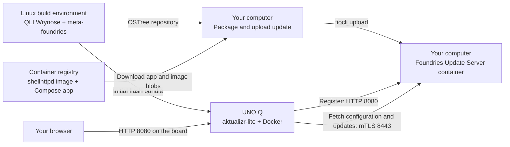

# Set Up UNO Q with Qualcomm Linux Wrynose and a Local Update Server

Build Qualcomm® Linux® (QLI) for Arduino® UNO Q, connect it to a containerized Foundries Update Server,
and deliver an update over your local network.
The walkthrough uses the existing Foundries `shellhttpd` example to make application changes visible in a browser.

Follow the four parts in order, using the same guide directory throughout:

1. [Build QLI Wrynose for UNO Q](build.md): prepare your Linux host and build the image.
2. [Flash UNO Q and connect to the board](flash.md): flash the image and connect through Bughopper or Android Debug Bridge (ADB).
3. [Set up the server and register UNO Q](server-registration.md): initialize the local container, enroll the device, and select applications.
4. [Deploy and update applications](application-updates.md): publish shellhttpd and complete the OS and application update exercises.

The walkthrough includes these checkpoints:

1. [Prepare your x86-64 Linux computer](build.md#prepare-the-build-host).
2. [Build a Wrynose image with meta-foundries](build.md#build-qli-from-wrynose).
3. [Flash and access the board, with or without a Bughopper](flash.md#flash-the-uno-q-and-open-a-shell).
4. [Start the update server in a container on your computer](server-registration.md#start-the-update-server-on-your-computer).
5. [Register your UNO Q](server-registration.md#register-the-uno-q) and [select its applications](server-registration.md#select-the-applications-the-board-should-run).
6. [Publish and roll out the first application](application-updates.md#package-and-deliver-shellhttpd-version-1).
7. [Deliver a second OS and application version, then verify the result](application-updates.md#deliver-os-version-2-and-shellhttpd-version-2).
8. [Add a second application without updating the OS](application-updates.md#add-a-second-application-without-updating-the-os).
9. [Update an existing application without updating the OS](application-updates.md#update-an-existing-application-without-updating-the-os).

> **Validation status:** The commands and configuration were checked against the sources listed in
> [validation.md](validation.md). This exact combination has not completed a build or physical UNO Q walkthrough.

## Understand the Setup

The computer and board share a local area network (LAN) with Internet access during setup.
The registry is used when packaging applications.
This guide uploads the complete application content to the update server, so the board does not need registry credentials.

The server uses `8080` for its UI and enrollment API, and `8443` for its authenticated device gateway.
The example also uses `8080`, on the **board's IP address**.

## Supporting Pages

- [Troubleshooting](troubleshooting.md)
- [Sources and validation](validation.md)

## References

- [Foundries Update Server quick-start](https://github.com/foundriesio/update-server/blob/208e846d50febb6024953ff5a0079b45b900a58b/docs/quick-start.md)
- [Building updates and Compose apps](https://github.com/foundriesio/update-server/blob/208e846d50febb6024953ff5a0079b45b900a58b/docs/build-an-update.md)
- [Uploading updates and creating rollouts](https://github.com/foundriesio/update-server/blob/208e846d50febb6024953ff5a0079b45b900a58b/docs/updates.md)
- [QLI Wrynose configuration](https://github.com/qualcomm-linux/meta-qcom-distro/tree/c3e4c471ddf7874b95a9d417a61019af25aa2c5b)
- [meta-foundries integration configuration](https://github.com/foundriesio/meta-foundries/blob/4dbe7efc08aef350f247aca83e518a9197c9a31a/ci/uno-q.yml)
- [Foundries shellhttpd example](https://github.com/foundriesio/containers/tree/5be067eb56d1cb59dcbf82568f36986705af9a8a/shellhttpd)
- [Arduino UNO Q manual](https://docs.arduino.cc/tutorials/uno-q/user-manual/)
- [Arduino Bughopper manual](https://docs.arduino.cc/tutorials/bughopper/user-manual/)
