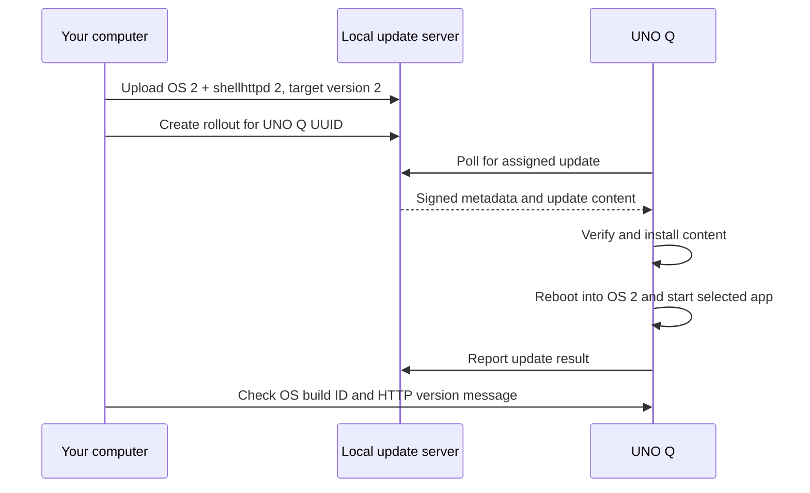
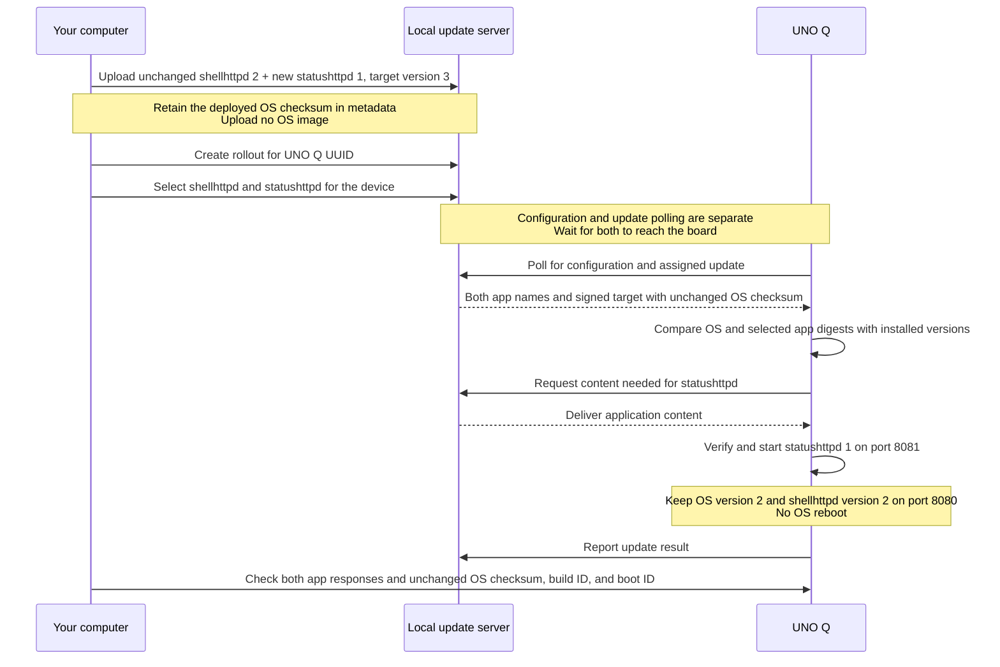
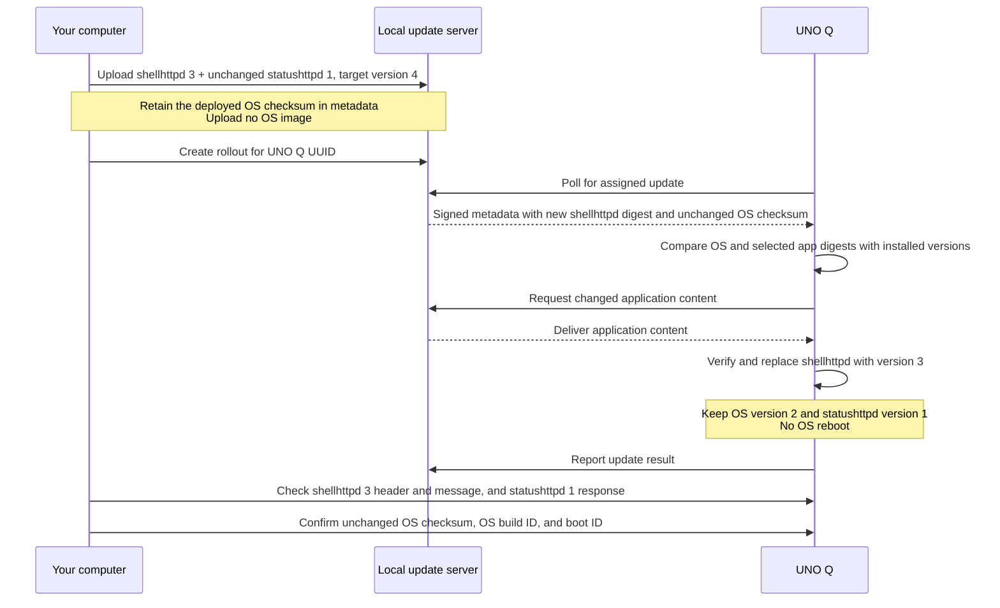

# Deploy and Update Applications on UNO Q

[Guide overview](README.md) · [Previous: Server and registration](server-registration.md) · **Part 4 of 4**

Complete [server setup and registration](server-registration.md) first, including the initial `shellhttpd` selection.
Run the four releases below in order; each exercise uses artifacts from the preceding release.

Continue in the same **update-server computer terminal**, with `GUIDE_DIR`, `UNOQ_UUID`, and the `dc` function available.
Keep that session open to retain the registry and application variables defined on this page.
If you open another terminal, restore those variables from your recorded values and repeat the `dc` function definition.
Keep the [Linux® build environment](build.md#install-kas-container-and-build-os-version-1), cache paths, and original lockfile for the OS version 2 build.

> **Validation status:** Source-reviewed draft. The complete build and hardware walkthrough remain pending.
> See [sources and validation](validation.md).

- [Package and deliver shellhttpd version 1](#package-and-deliver-shellhttpd-version-1)
- [Deliver OS version 2 and shellhttpd version 2](#deliver-os-version-2-and-shellhttpd-version-2)
- [Add a second application without updating the OS](#add-a-second-application-without-updating-the-os)
- [Update an existing application without updating the OS](#update-an-existing-application-without-updating-the-os)

## Package and Deliver shellhttpd Version 1

### How aktualizr-lite Discovers Application Updates

aktualizr-lite periodically checks the update server for an assigned, signed update target.
That target identifies an OS commit and the digest-pinned Compose applications available to the device.
The client compares those applications with its installed state and applies changes to the selected apps.
When the target retains the booted OS commit, an application-only update can complete without an OS update or reboot.

Publishing a new registry image is the packaging step.
Publish a Compose app referencing the new image digest.
Then upload a new target to the update server and create a rollout.
aktualizr-lite then discovers the assigned target through normal polling.
Changing a registry tag such as `latest` alone does not change the digest pinned in an existing target.

The later `--ostree-hash` step supplies the retained OS identity when creating an app-only target on this server.
aktualizr-lite already supports application-only updates; that flag belongs to the server-side upload command.
See the client's [app comparison](https://github.com/foundriesio/aktualizr-lite/blob/7bb558258bd64214abf27e4bb6567a17f9cf7854/src/composeappmanager.cc#L221)
and [unchanged OS handling](https://github.com/foundriesio/aktualizr-lite/blob/7bb558258bd64214abf27e4bb6567a17f9cf7854/src/rootfstreemanager.cc#L175).

### Prepare the Application Registry

This section follows the upstream [Build Apps](https://github.com/foundriesio/update-server/blob/208e846d50febb6024953ff5a0079b45b900a58b/docs/build-an-update.md#build-apps)
and [update upload](https://github.com/foundriesio/update-server/blob/208e846d50febb6024953ff5a0079b45b900a58b/docs/updates.md) workflow.
It includes both the OSTree repository and the downloaded app/image blobs in the upload.

Use a registry account that can publish a container image and a Compose app.
Packages may stay private because only the packaging computer accesses the registry.

Use an Open Container Initiative (OCI) registry that supports the artifacts published by `composectl`.
Follow its login instructions and set these variables:

```bash
export REGISTRY_PREFIX='registry.example.com/your-namespace'
export IMAGE_REPO="$REGISTRY_PREFIX/unoq-shellhttpd-image"
export IMAGE_REF="$IMAGE_REPO:v1"
export APP_REPO="$REGISTRY_PREFIX/shellhttpd"
```

Authenticate your host Docker client and provide a Docker-compatible `config.json` in `.registry-auth/`
for the tools container.
Host credential helpers cannot run inside that container.
The authentication file must contain credentials that the tools container can read directly.

### Build the Existing Foundries Example

On the **host**:

```bash
cd "$GUIDE_DIR/workspace"
git clone https://github.com/foundriesio/containers.git
git -C containers checkout 5be067eb56d1cb59dcbf82568f36986705af9a8a
```

Build and push the example's ARM64 image:

```bash
docker buildx build --platform linux/arm64 --push \
  --tag "$IMAGE_REF" \
  --metadata-file "$GUIDE_DIR/workspace/shellhttpd-image.json" \
  "$GUIDE_DIR/workspace/containers/shellhttpd"
```

An ARM64 build on Linux may report an unsupported execution platform.
Configure a native ARM64 builder or Docker's [documented emulation support](https://docs.docker.com/build/building/multi-platform/), then retry.

Read the pushed digest:

```bash
export IMAGE_DIGEST="$(python3 -c 'import json,sys; print(json.load(open(sys.argv[1]))["containerimage.digest"])' \
  "$GUIDE_DIR/workspace/shellhttpd-image.json")"
```

Create an app configuration using the example's HTTP service, with a visible version message:

```bash
mkdir -p "$GUIDE_DIR/workspace/apps/v1"
cat > "$GUIDE_DIR/workspace/apps/v1/docker-compose.yml" <<EOF
version: '3.2'
services:
  httpd:
    image: $IMAGE_REPO@$IMAGE_DIGEST
    restart: always
    ports:
      - "8080:8080"
    environment:
      MSG: "UNO Q: shellhttpd version 1"
EOF
```

This uses the existing example's Dockerfile and `httpd.sh`.
The Compose file pins its image digest and changes the displayed `MSG` value.

### Publish the Compose App and Download Its Content

```bash
dc run --rm -w /work/apps/v1 tools composectl publish \
  -d app.hash "$APP_REPO:v1" arm64
export APP_HASH="$(cat "$GUIDE_DIR/workspace/apps/v1/app.hash")"
export APP_HASH="${APP_HASH#sha256:}"
dc run --rm tools composectl --arch arm64 pull \
  -i /work/releases/1/apps -s /work/releases/1/apps \
  "$APP_REPO@sha256:$APP_HASH"
```

The last command downloads the Compose app and its referenced ARM64 image content.
The release directory should now have both top-level entries:

```text
workspace/releases/1/
├── ostree_repo/
└── apps/
    ├── apps/shellhttpd/<app-hash>/...
    └── ... app and container blobs ...
```

The `shellhttpd` app name comes from the final component of the Compose app repository name.
Keep that name consistent with the device's selection.

### Upload, Create a Rollout, and Verify

```bash
dc run --rm tools fiocli updates upload wrynose unoq-001 /work/releases/1 \
  --version 1 --hardware-id uno-q --name unoq-wrynose-001
dc run --rm tools fiocli updates list
dc run --rm tools fiocli updates create-rollout unoq-001 first-device \
  --uuids "$UNOQ_UUID"
dc run --rm tools fiocli updates tail unoq-001 --rollout first-device
```

**Uploading stores the content; the rollout makes it available to the selected device.**
Stop the event display with Ctrl+C after the result appears.
The updater polls periodically, so a rollout may not start immediately.

On the **UNO Q**, inspect progress:

```bash
journalctl -u aktualizr-lite -f
```

After success, stop the log display with Ctrl+C and check:

```bash
docker ps
curl http://127.0.0.1:8080/
```

The response should contain `UNO Q: shellhttpd version 1`.
From your computer, open `http://UNOQ_DEVICE_IP:8080/`, replacing `UNOQ_DEVICE_IP` with the board's address.
The initial OS is already installed, so this first rollout does not demonstrate a change of OS revision.

## Deliver OS Version 2 and shellhttpd Version 2



### Build the Second OS

In the **Linux build environment**, retain the original cache paths and lockfile:

```bash
cd "$GUIDE_DIR"
kas-container build kas/uno-q-wrynose.yml:kas/os-v2.yml
mkdir -p "$GUIDE_DIR/workspace/releases/2"
cp -a "$KAS_WORK_DIR/build/tmp/deploy/images/uno-q/ostree_repo" \
  "$GUIDE_DIR/workspace/releases/2/ostree_repo"
```

The new `BUILD_ID` changes the OS content and makes the installed version easy to check.
Transfer `releases/2/ostree_repo` to the local computer if using a separate builder.
Do not flash the second image; deliver it through the update server.

### Package the Second App

On the **host**, keep the same container image and change its Compose configuration:

```bash
mkdir -p "$GUIDE_DIR/workspace/apps/v2"
sed 's/shellhttpd version 1/shellhttpd version 2/' \
  "$GUIDE_DIR/workspace/apps/v1/docker-compose.yml" \
  > "$GUIDE_DIR/workspace/apps/v2/docker-compose.yml"
dc run --rm -w /work/apps/v2 tools composectl publish \
  -d app.hash "$APP_REPO:v2" arm64
export APP_HASH="$(cat "$GUIDE_DIR/workspace/apps/v2/app.hash")"
export APP_HASH="${APP_HASH#sha256:}"
dc run --rm tools composectl --arch arm64 pull \
  -i /work/releases/2/apps -s /work/releases/2/apps \
  "$APP_REPO@sha256:$APP_HASH"
```

Each release now contains its own OS repository and app content.
The app selection remains `shellhttpd`; only its packaged version changes.

### Upload and Roll Out Version 2

On the **UNO Q**, record the current boot ID and OS deployment before starting:

```bash
cat /proc/sys/kernel/random/boot_id
ostree admin status
```

On the **host**:

```bash
dc run --rm tools fiocli updates upload wrynose unoq-002 /work/releases/2 \
  --version 2 --hardware-id uno-q --name unoq-wrynose-002
dc run --rm tools fiocli updates create-rollout unoq-002 second-version \
  --uuids "$UNOQ_UUID"
dc run --rm tools fiocli updates tail unoq-002 --rollout second-version
```

Keep the board powered and allow the updater to reboot it.
If using Android Debug Bridge (ADB), it disconnects during reboot; reconnect with `adb shell` when the device reappears.
If using a Bughopper, keep the serial console open to observe the reboot and continue in that shell.

On the **UNO Q** after the update:

```bash
cat /etc/os-release
cat /proc/sys/kernel/random/boot_id
ostree admin status
docker ps
curl http://127.0.0.1:8080/
journalctl -u aktualizr-lite -n 100 --no-pager
```

Confirm all of the following:

- The running OS reports `BUILD_ID="unoq-wrynose-os-2"`.
- The boot ID differs from the value recorded before the rollout.
- The booted OSTree deployment changed and the updater reports success.
- HTTP returns `UNO Q: shellhttpd version 2`.
- The server shows a recent heartbeat and a successful update result for `unoq-002`.

For future updates, use a new update name and a strictly increasing `--version`.
Increase that version even when only the app changes and the OS stays the same.
Keep the last successful release directory and its build lockfile for diagnosis and recovery.

## Add a Second Application Without Updating the OS

Continue after `unoq-002` completes successfully.
The board should run OS version 2 and `shellhttpd` version 2.
This section adds a separately managed Compose app named `statushttpd`, using the same Foundries example on port **8081**.
The existing `shellhttpd` app remains on port **8080**.

There is no OS build or flashing step.
Every update target identifies an OS revision and a set of applications.
For an application-only update, set `--ostree-hash` to the checksum of the OS already running on the board.
This tells the updater to retain that OS revision while applying the changed applications.
The upload contains only application content; the checksum is metadata, not an OS image upload.
Keep both applications in each subsequent target's app set, even when only one changes.

| Update | OS | shellhttpd, port 8080 | statushttpd, port 8081 |
| --- | --- | --- | --- |
| `unoq-002`, target version 2 | OS version 2 | App version 2 | Absent |
| `unoq-003`, target version 3 | Same OS checksum | Same app digest | App version 1 added |
| `unoq-004`, target version 4 | Same OS checksum | App version 3 | Same app digest |



### Record the Running OS and Boot ID

On the **UNO Q**, record the baseline before either application-only update:

```bash
cat /proc/sys/kernel/random/boot_id > /var/tmp/unoq-before-app-updates.boot-id
ostree admin status > /var/tmp/unoq-before-app-updates.ostree
cat /var/tmp/unoq-before-app-updates.ostree
cat /etc/os-release
```

In `ostree admin status`, find the booted deployment, marked with `*`.
Copy its full **64-character OS commit checksum**, excluding any trailing deployment serial such as `.0`.
Confirm that the OS build ID is still `unoq-wrynose-os-2`.

In the **update-server computer terminal**, enter that checksum:

```bash
read -r -p "Paste the UNO Q's booted OS commit checksum (64 hex characters): " DEPLOYED_OS_HASH
export DEPLOYED_OS_HASH
printf '%s\n' "$DEPLOYED_OS_HASH" > "$GUIDE_DIR/workspace/deployed-os.sha256"
```

Use this same checksum for both application-only releases below.
The `--ostree-hash` flag is essential when the upload has no `ostree_repo/` directory.
The server does not infer the current OS checksum from the device.
Omitting the flag therefore does not mean "keep the current OS."
The server also needs `--hardware-id uno-q` because it cannot probe the OS repository.

### Package the Additional App

Run all `dc`, registry, and packaging commands in the **update-server computer terminal**.
Keep `GUIDE_DIR`, `REGISTRY_PREFIX`, `APP_REPO`, `UNOQ_UUID`, and the `dc` function from the preceding sections.

Create a separate Compose app from the existing version 2 configuration:

```bash
export SECOND_APP_REPO="$REGISTRY_PREFIX/statushttpd"
mkdir -p "$GUIDE_DIR/workspace/apps/statushttpd-v1"
sed -e 's/"8080:8080"/"8081:8080"/' \
    -e 's/UNO Q: shellhttpd version 2/UNO Q: statushttpd version 1/' \
  "$GUIDE_DIR/workspace/apps/v2/docker-compose.yml" \
  > "$GUIDE_DIR/workspace/apps/statushttpd-v1/docker-compose.yml"
dc run --rm -w /work/apps/statushttpd-v1 tools composectl publish \
  -d app.hash "$SECOND_APP_REPO:v1" arm64
```

This publishes a distinct application named `statushttpd`, with its own Compose configuration and digest.
It reuses the existing container image, so there is no container-image rebuild in this section.
This creates an additional package under your chosen namespace.

Start with a new, empty `releases/3` directory and download **both** desired applications into it:

```bash
export SHELLHTTPD_V2_HASH="$(cat "$GUIDE_DIR/workspace/apps/v2/app.hash")"
export SHELLHTTPD_V2_HASH="${SHELLHTTPD_V2_HASH#sha256:}"
export STATUSHTTPD_V1_HASH="$(cat "$GUIDE_DIR/workspace/apps/statushttpd-v1/app.hash")"
export STATUSHTTPD_V1_HASH="${STATUSHTTPD_V1_HASH#sha256:}"
mkdir "$GUIDE_DIR/workspace/releases/3" && \
dc run --rm tools composectl --arch arm64 pull \
  -i /work/releases/3/apps -s /work/releases/3/apps \
  "$APP_REPO@sha256:$SHELLHTTPD_V2_HASH" \
  "$SECOND_APP_REPO@sha256:$STATUSHTTPD_V1_HASH"
```

If `releases/3` already exists, stop and inspect it before proceeding.
Use a fresh staging directory for each release so older app digests cannot enter the new target accidentally.
This release contains only `apps/`; do not copy an OS repository into it.

### Upload, Roll Out, and Select Both Apps

In the **update-server computer terminal**:

```bash
dc run --rm tools fiocli updates upload wrynose unoq-003 /work/releases/3 \
  --version 3 --hardware-id uno-q --name unoq-wrynose-apps-003 \
  --ostree-hash "${DEPLOYED_OS_HASH:?Record the current OS checksum first}"
dc run --rm tools fiocli updates create-rollout unoq-003 add-status-app \
  --uuids "$UNOQ_UUID"
dc run --rm tools fiocli configs updates --device "$UNOQ_UUID" \
  --tag wrynose --apps shellhttpd,statushttpd
dc run --rm tools fiocli updates tail unoq-003 --rollout add-status-app
```

The selection lists both apps because it replaces the device's explicit app list.
Configuration and update polling are separate; allow time for both to reach the board.
If an update event completes before the configuration arrives, continue until both applications are running.

### Verify the Second App and Unchanged OS

On the **UNO Q**, after the update and configuration have been applied:

```bash
docker ps
curl http://127.0.0.1:8080/
curl http://127.0.0.1:8081/
cat /etc/os-release
ostree admin status
cmp /var/tmp/unoq-before-app-updates.boot-id /proc/sys/kernel/random/boot_id
```

Confirm that port 8080 returns `UNO Q: shellhttpd version 2` and port 8081 returns `UNO Q: statushttpd version 1`.
The booted OS checksum and `BUILD_ID` must match the recorded baseline.
`cmp` should exit successfully with no output, confirming that the boot ID has not changed.
An OS change or reboot is an unexpected result for this walkthrough; investigate before continuing.

From your computer, the new app is also available at `http://UNOQ_DEVICE_IP:8081/`.
Use the board's actual address, as you did for port 8080.

## Update an Existing Application Without Updating the OS

Continue after `unoq-003` has both applications running.
This section rebuilds the `shellhttpd` container image with an identifiable HTTP response header,
then publishes a new version of that existing Compose app.
The OS checksum and `statushttpd` app digest remain the same.



### Build a New shellhttpd Image

In the **update-server computer terminal**, create a separate build directory from the original Foundries example:

```bash
mkdir "$GUIDE_DIR/workspace/shellhttpd-build-v3" && \
cp -R "$GUIDE_DIR/workspace/containers/shellhttpd/." \
  "$GUIDE_DIR/workspace/shellhttpd-build-v3/"
```

If that directory already exists, inspect it before proceeding.
Add an `X-App-Version: 3` response header to the copied script:

```bash
python3 - "$GUIDE_DIR/workspace/shellhttpd-build-v3/httpd.sh" <<'PY'
from pathlib import Path
import sys

path = Path(sys.argv[1])
source = path.read_text()
old = r'HTTP/1.1 200 OK\r\n\r\n'
new = r'HTTP/1.1 200 OK\r\nX-App-Version: 3\r\n\r\n'
if source.count(old) != 1:
    raise SystemExit("Expected original HTTP response not found; inspect httpd.sh before continuing.")
path.write_text(source.replace(old, new))
PY
docker buildx build --platform linux/arm64 --push \
  --tag "$IMAGE_REPO:v3" \
  --metadata-file "$GUIDE_DIR/workspace/shellhttpd-image-v3.json" \
  "$GUIDE_DIR/workspace/shellhttpd-build-v3"
export IMAGE_V3_DIGEST="$(python3 -c 'import json,sys; print(json.load(open(sys.argv[1]))["containerimage.digest"])' \
  "$GUIDE_DIR/workspace/shellhttpd-image-v3.json")"
```

This changes application code inside the container image.
It does not rebuild Qualcomm Linux or change the board's OS.

### Publish the Replacement App and Retain the Other App

In the **update-server computer terminal**, pin the new image digest in the `shellhttpd` Compose app:

```bash
mkdir -p "$GUIDE_DIR/workspace/apps/v3"
cat > "$GUIDE_DIR/workspace/apps/v3/docker-compose.yml" <<EOF
version: '3.2'
services:
  httpd:
    image: $IMAGE_REPO@$IMAGE_V3_DIGEST
    restart: always
    ports:
      - "8080:8080"
    environment:
      MSG: "UNO Q: shellhttpd version 3"
EOF
dc run --rm -w /work/apps/v3 tools composectl publish \
  -d app.hash "$APP_REPO:v3" arm64
export SHELLHTTPD_V3_HASH="$(cat "$GUIDE_DIR/workspace/apps/v3/app.hash")"
export SHELLHTTPD_V3_HASH="${SHELLHTTPD_V3_HASH#sha256:}"
export STATUSHTTPD_V1_HASH="$(cat "$GUIDE_DIR/workspace/apps/statushttpd-v1/app.hash")"
export STATUSHTTPD_V1_HASH="${STATUSHTTPD_V1_HASH#sha256:}"
mkdir "$GUIDE_DIR/workspace/releases/4" && \
dc run --rm tools composectl --arch arm64 pull \
  -i /work/releases/4/apps -s /work/releases/4/apps \
  "$APP_REPO@sha256:$SHELLHTTPD_V3_HASH" \
  "$SECOND_APP_REPO@sha256:$STATUSHTTPD_V1_HASH"
```

Use a fresh `releases/4` directory containing only `apps/`.
The target includes the new `shellhttpd` and the original `statushttpd` digests.
An application-only target still describes the complete desired app set; do not omit an app you want to retain.

### Deliver the Application-Only Update

In the **update-server computer terminal**:

```bash
export DEPLOYED_OS_HASH="$(cat "$GUIDE_DIR/workspace/deployed-os.sha256")"
dc run --rm tools fiocli updates upload wrynose unoq-004 /work/releases/4 \
  --version 4 --hardware-id uno-q --name unoq-wrynose-apps-004 \
  --ostree-hash "${DEPLOYED_OS_HASH:?Record the current OS checksum first}"
dc run --rm tools fiocli updates create-rollout unoq-004 update-shellhttpd \
  --uuids "$UNOQ_UUID"
dc run --rm tools fiocli updates tail unoq-004 --rollout update-shellhttpd
```

Keep the device selection as `shellhttpd,statushttpd`.
The target version increases to 4 even though the OS stays at version 2.
The application container may restart while its replacement is installed; the OS should continue running without a reboot.

### Verify the New App While the OS Stays Unchanged

On the **UNO Q**, after the update succeeds:

```bash
curl -i http://127.0.0.1:8080/
curl http://127.0.0.1:8081/
docker ps
cat /etc/os-release
ostree admin status
cmp /var/tmp/unoq-before-app-updates.boot-id /proc/sys/kernel/random/boot_id
journalctl -u aktualizr-lite -n 100 --no-pager
```

Confirm all of the following:

- Port 8080 returns header `X-App-Version: 3` and body `UNO Q: shellhttpd version 3`.
- Port 8081 still returns `UNO Q: statushttpd version 1`.
- The booted OS checksum and build ID remain at the recorded OS version 2 baseline.
- `cmp` reports no boot-ID difference.
- The server reports successful completion of `unoq-004`.

These checks demonstrate an application-image update without an OS update.
If another process reboots or updates the board during the exercise, establish a new baseline and repeat the verification.

After the exercises, you can [stop and restart the local server](server-registration.md#stop-and-restart-the-local-server).
For a failed checkpoint, see [troubleshooting](troubleshooting.md).
