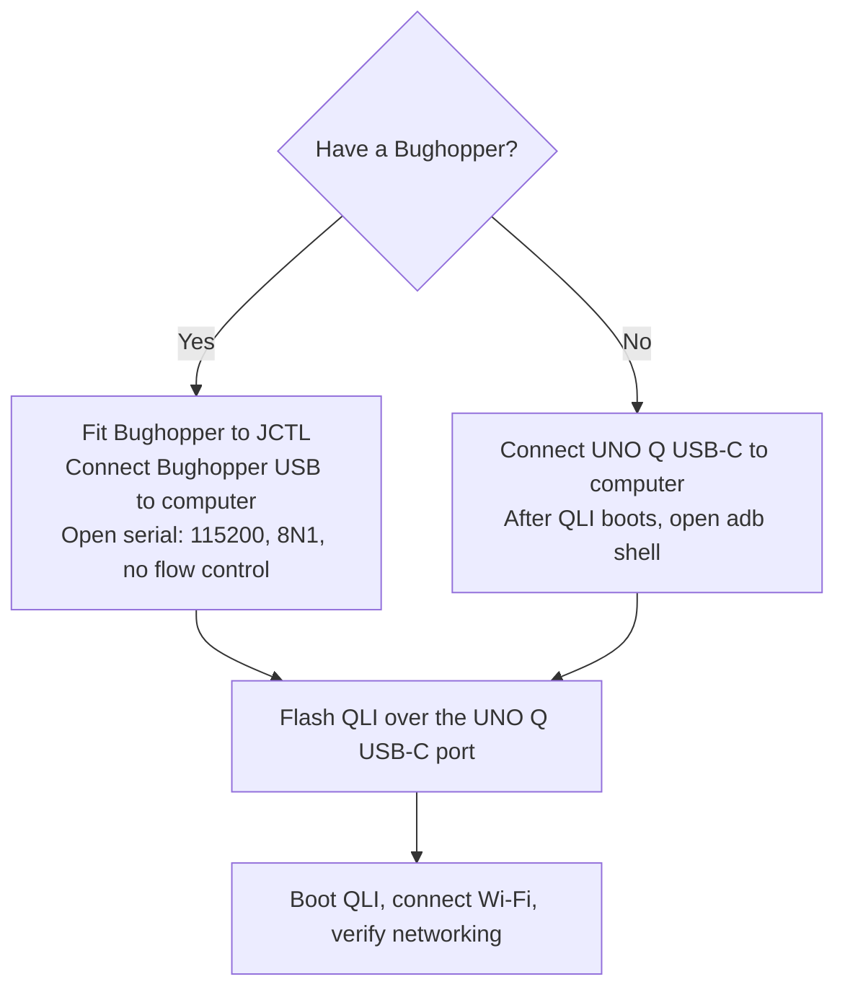

# Build and Flash UNO Q with QLI Wrynose

[Guide overview](README.md) · **Part 1 of 3**

Prepare your computer, build Qualcomm® Linux® (QLI) with meta-foundries, and flash Arduino® UNO Q.
Choose Bughopper serial access or Android Debug Bridge (ADB), then connect the board to your network.

> **Validation status:** Source-reviewed draft. The complete build and hardware walkthrough remain pending.
> See [sources and validation](validation.md).

- [Prepare the equipment and host](#prepare-the-equipment-and-host)
- [Build QLI from Wrynose](#build-qli-from-wrynose)
- [Flash the UNO Q and open a shell](#flash-the-uno-q-and-open-a-shell)

## Prepare the Equipment and Host

You need an UNO Q, a USB-C data cable, a network the board can join, and a computer running Docker.
For serial access, add a Bughopper and a second USB data cable.
Without a Bughopper, keep a jumper cap or female-to-female jumper available for Emergency Download (EDL) mode.

Use an x86-64 Linux build environment with a case-sensitive Linux filesystem.
As a planning allowance, provide 16 GB RAM and 200 GB free disk space; actual requirements vary with caches and parallelism.
Reuse existing download and shared-state caches when available.

### Choose Your Host Path

The Windows build path uses Windows Subsystem for Linux (WSL) with Ubuntu.

| Your computer | Build the QLI image | Run the local server and package apps | Flash and access USB |
| --- | --- | --- | --- |
| Linux x86-64 | Native Linux with `kas-container` | Docker Engine and Compose | Native `qdl`; serial terminal with Bughopper, or ADB without one |
| Windows x86-64 | Ubuntu under WSL 2, using its Linux filesystem | Docker Desktop with Ubuntu WSL integration | Native Windows `qdl`; serial terminal with Bughopper, or native ADB without one |
| macOS, Intel | An x86-64 Linux VM or remote Linux builder | Docker Desktop for Mac | Native macOS `qdl`; serial terminal with Bughopper, or ADB without one |
| macOS, Apple Silicon; Windows ARM | A remote x86-64 Linux builder for this guide | Docker Desktop on the computer | Native `qdl` matching the processor architecture; serial terminal with Bughopper, or ADB without one |

The macOS and Windows ARM paths require access to that Linux builder.
This guide does not claim that this BSP builds natively on an ARM host.
The server remains on your local computer even when the image build runs elsewhere.

**Linux:** Install [Docker Engine](https://docs.docker.com/engine/install/ubuntu/), including the Compose and Buildx plugins.
Install Git, Git Large File Storage (LFS), Python 3, and curl using your distribution's packages.
For Ubuntu:

```bash
sudo apt update
sudo apt install git git-lfs python3 curl
git lfs install
```

**Windows:** Install [WSL 2 with Ubuntu](https://learn.microsoft.com/en-us/windows/wsl/install)
and [Docker Desktop](https://docs.docker.com/desktop/setup/install/windows-install/).
Enable Ubuntu under **Settings → Resources → WSL Integration**.
Run this guide's Bash commands inside Ubuntu, with files under `~/`, rather than `/mnt/c/`.
Run the Ubuntu package commands above inside WSL.
Use PowerShell only where a block is explicitly marked for Windows USB access.

**macOS:** Install [Docker Desktop](https://docs.docker.com/desktop/setup/install/mac-install/),
Git, and Python 3.
Use Terminal for host commands and SSH to your Linux builder for image-build commands.
Copy the guide directory to both computers, and retain the same build configuration and lockfile.

**All hosts:** Download [`qdl` v2.8](https://github.com/linux-msm/qdl/releases/tag/v2.8)
for your host OS and processor architecture, extract it, and add its directory to `PATH`.
Keep the supporting files from the `qdl` archive together.

Install the console tool for your chosen connection:

- **With a Bughopper:** Use a serial terminal. On Ubuntu, install it with `sudo apt install picocom`;
  on macOS, use `screen`; on Windows, use PuTTY. ADB is optional and is not needed for this walkthrough.
- **Without a Bughopper:** Install ADB. On native Ubuntu, run `sudo apt install adb`.
  On macOS and Windows, install [Android SDK Platform-Tools](https://developer.android.com/tools/releases/platform-tools).

Both paths use `qdl` and the UNO Q's own USB-C port for flashing.

Check Docker from your local host shell:

```bash
docker run --rm hello-world
docker compose version
docker buildx version
```

### Establish a Working Directory

Copy this entire guide directory to your computer, including `kas/` and `server/`.
Open a Bash shell in that directory:

```bash
export GUIDE_DIR="$PWD"
mkdir -p "$GUIDE_DIR/workspace" "$GUIDE_DIR/.registry-auth"
chmod 700 "$GUIDE_DIR/.registry-auth"
```

In a new shell, return to this directory and set `GUIDE_DIR` again.
On Windows, this directory resides in Ubuntu's Linux filesystem.

## Build QLI From Wrynose

Run this section in your **Linux build environment**.
The configuration selects `qcom-distro-sota` and machine `uno-q`, supplied by `meta-qcom-arduino`.
It builds `core-image-full-cmdline` with the platform updater, Docker application support, networking, and ADB.
ADB is enabled in the shared image so either console path works; Bughopper users can complete the guide entirely through serial.

### What Is Pinned, and What Uses Wrynose?

| Component | Selection |
| --- | --- |
| Qualcomm Linux distro | `meta-qcom-distro`, **wrynose**, pinned revision |
| Qualcomm BSP | `meta-qcom`, **wrynose**, pinned revision |
| OpenEmbedded Core, `meta-openembedded`, `meta-virtualization`, `meta-selinux`, `meta-security` | **wrynose** |
| meta-updater | **wrynose**, pinned revision |
| BitBake | **2.18**, the Wrynose series |
| Linux firmware mixin | `wrynose/linux-firmware`, with the patch referenced by QLI's BSP configuration |
| meta-foundries | Pinned revision; no Wrynose branch exists at the source-review date |
| Arduino board layer | Pinned revision from `main`; that revision explicitly declares Wrynose compatibility |

The last two pins supply the integration and machine support.
The QLI distro and BSP use Wrynose.
The [companion configuration](kas/uno-q-wrynose.yml) overrides the upstream CI configuration's moving branch selections.
Do not substitute a plain `ci/uno-q.yml` build command: that configuration selects development branches.

### Install kas-container and Build OS Version 1

Install the [kas-container wrapper](https://kas.readthedocs.io/en/latest/userguide.html#kas-container)
and put it on `PATH`.
The example below fixes the wrapper and build-container version at 5.4:

```bash
mkdir -p "$HOME/.local/bin"
curl -fL https://raw.githubusercontent.com/siemens/kas/5.4/kas-container \
  -o "$HOME/.local/bin/kas-container"
chmod +x "$HOME/.local/bin/kas-container"
export PATH="$HOME/.local/bin:$PATH"
export KAS_IMAGE_VERSION=5.4
export KAS_WORK_DIR="$HOME/unoq-build"
export DL_DIR="$HOME/yocto-cache/downloads"
export SSTATE_DIR="$HOME/yocto-cache/sstate"
mkdir -p "$KAS_WORK_DIR" "$DL_DIR" "$SSTATE_DIR"
```

Change the cache paths to your existing caches when appropriate.
Keep the build tree on Linux storage, including when using WSL or a VM.

Generate a lockfile for the remaining layer revisions, then build:

```bash
cd "$GUIDE_DIR"
kas-container lock kas/uno-q-wrynose.yml
kas-container build kas/uno-q-wrynose.yml:kas/os-v1.yml
```

Retain the generated `kas/uno-q-wrynose.lock.yml` with your build records.
Use the same lockfile for OS version 2.
Do not update layer revisions between the two builds in this walkthrough.

The deployment directory is:

```bash
export DEPLOY="$KAS_WORK_DIR/build/tmp/deploy/images/uno-q"
ls "$DEPLOY"
```

Before continuing, confirm that it contains an `ostree_repo` directory and
`core-image-full-cmdline-uno-q.rootfs.qcomflash`.
Inspect the flash directory for `prog_firehose_ddr.elf`, `rawprogram0.xml`, and `patch0.xml`.

Preserve the OS repository before the next build changes it:

```bash
mkdir -p "$GUIDE_DIR/workspace/releases/1"
cp -a "$DEPLOY/ostree_repo" "$GUIDE_DIR/workspace/releases/1/ostree_repo"
tar -chzf "$GUIDE_DIR/workspace/unoq-os1-flash.tar.gz" \
  -C "$DEPLOY" core-image-full-cmdline-uno-q.rootfs.qcomflash
```

The archive follows symlinks so the transferred flash bundle contains its referenced files.
If your builder is remote, transfer the archive and `releases/1/ostree_repo` to the local guide's `workspace/`.
For example, on the local computer, replacing the host and paths:

```bash
scp builder:/absolute/path/to/guide/workspace/unoq-os1-flash.tar.gz "$GUIDE_DIR/workspace/"
mkdir -p "$GUIDE_DIR/workspace/releases/1"
scp -r builder:/absolute/path/to/guide/workspace/releases/1/ostree_repo \
  "$GUIDE_DIR/workspace/releases/1/"
```

## Flash the UNO Q and Open a Shell

> **Flashing replaces the board's Linux installation and stored data.** Save anything you need before proceeding.
> This installs the QLI image built above; Arduino App Lab workflows are outside this guide.

### Choose Your Console Connection



#### With a Bughopper

With power disconnected, align the Bughopper with the UNO Q's `JCTL` header as shown in
[Arduino's Bughopper manual](https://docs.arduino.cc/tutorials/bughopper/user-manual/).
Connect its USB port to the computer, and connect the UNO Q's own USB-C port separately for flashing and power.


*Hardware illustration: Arduino documentation. Use the linked manual for connector orientation.*

Open the Bughopper serial port at **115200 baud, 8 data bits, no parity, 1 stop bit, no flow control**.

| Host | Port and terminal |
| --- | --- |
| Linux | Identify `/dev/serial/by-id/`; open it with `picocom -b 115200 /dev/serial/by-id/<your-port>` |
| macOS | Identify `/dev/cu.usbserial-*`; use `screen /dev/cu.usbserial-<id> 115200` |
| Windows | Find the FTDI serial port in Device Manager; open it in PuTTY with the settings above |

Install [FTDI virtual serial-port drivers](https://ftdichip.com/drivers/vcp-drivers/) if the port does not appear.
On Linux, your account may need membership in the serial device's group, normally `dialout`.
Log out and back in after changing group membership.

After flashing, this console displays boot output and provides a Linux shell.
The supplied development configuration enables root serial autologin.

#### Without a Bughopper

The build configuration explicitly enables `image-adbd` and `enable-adbd`.
Keep the UNO Q's USB-C data cable connected after flashing.
After QLI boots, use ADB to open a shell as described below.
ADB becomes available after Linux starts; a Bughopper can also show earlier boot output.

### Enter EDL Mode

Choose your method based on your setup:

#### With a Bughopper

If you have a Bughopper attached to the `JCTL` connector, use the tool [pytactl](https://github.com/qualcomm/pytactl) to enter EDL mode
programmatically. This method requires no cable disconnection or jumper manipulation.

First, install `pytactl` on your host computer:

```bash
pip install pytactl
```

Then, with the board powered on and the Bughopper connected, find the device serial ID:

```bash
pytactl list
```

Replace `<ID_SERIAL_SHORT>` with your board's serial ID, visible in the `pytactl list` output as `SERIAL=<ID_SERIAL_SHORT>`:

```bash
pytactl oneshot bootToEDL --serial <ID_SERIAL_SHORT>
```

The board enters EDL mode without disconnecting the Bughopper or USB cables.

For more information, troubleshooting steps, and advanced usage, see the [pytactl project documentation](https://github.com/qualcomm/pytactl).

#### Without a Bughopper

Follow Arduino's [UNO Q EDL procedure](https://docs.arduino.cc/software/app-lab/configure/flash/#step-1-set-your-board-to-edl-mode).
Disconnect board power and short the designated EDL pins.
Then connect the UNO Q USB-C port to your computer.
Remove the short once the board has entered EDL.
When a Bughopper occupies `JCTL`, disconnect it while using the jumper procedure.
Reconnect the Bughopper with power removed after flashing.


*EDL illustration: Arduino documentation. Follow the marked pins rather than shorting an unidentified header pair.*

On Linux, check for the EDL USB device:

```bash
lsusb -d 05c6:9008
```

On macOS, inspect **System Information → USB**.
On Windows, inspect Device Manager for the EDL device.
`qdl` must have USB access; consult its [host instructions](https://github.com/linux-msm/qdl/blob/v2.8/README.md)
if it cannot open the device.

### Write the Image

On the **local computer**, extract the flash archive:

```bash
mkdir -p "$GUIDE_DIR/workspace/flash-os1"
tar -xzf "$GUIDE_DIR/workspace/unoq-os1-flash.tar.gz" \
  -C "$GUIDE_DIR/workspace/flash-os1"
```

**Linux or macOS:**

```bash
cd "$GUIDE_DIR/workspace/flash-os1/core-image-full-cmdline-uno-q.rootfs.qcomflash"
qdl --storage emmc --debug prog_firehose_ddr.elf rawprogram0.xml patch0.xml
```

On Linux, use the [Arduino USB permissions setup](https://docs.arduino.cc/software/app-lab/setup/linux/)
if `qdl` reports insufficient permissions.

**Windows:** Copy the extracted flash directory from WSL to a Windows directory, such as `C:\unoq\flash-os1`.
Open PowerShell in the copied directory containing the programmer, `rawprogram0.xml`, and `patch0.xml` files:

```powershell
qdl.exe --storage emmc --debug prog_firehose_ddr.elf rawprogram0.xml patch0.xml
```

Use native Windows `qdl` for this path.
The [`qdl` documentation](https://github.com/linux-msm/qdl/blob/v2.8/README.md#flashing-from-wsl2-usbipd-win)
records reliability problems with EDL flashing through WSL USB forwarding.

Wait for `qdl` to complete successfully.
Disconnect power and remove the EDL short if it is still connected.
Reconnect the board for normal boot.

### Open the QLI Shell and Connect Wi-Fi

With a Bughopper, use the serial shell.
Without one, run these commands on the host after the board finishes booting:

```bash
adb devices
adb root
adb shell
```

On Windows PowerShell, use `adb.exe` if `adb` is not on `PATH`.
Run native ADB against the USB-connected board; WSL commands need separate USB forwarding.
If more than one ADB device appears, add `-s <serial>` to each command.

Run the following **on the UNO Q**, as root:

```bash
cat /etc/os-release
command -v fio-device-register
command -v aktualizr-lite
docker version
nmcli device wifi rescan
nmcli device wifi list
nmcli --ask device wifi connect "YOUR_WIFI_SSID"
ip -4 address
ip route
date -u
```

Enter the Wi-Fi password when prompted.
Record the board's local-network IP address as `UNOQ_DEVICE_IP` on your computer.
Confirm that `/etc/os-release` identifies Qualcomm Linux and `BUILD_ID="unoq-wrynose-os-1"`.
Check that the board's clock is correct before enrolling it.

**Next:** [Set up the server and register UNO Q](server-registration.md).
Keep the guide directory, OS repository, lockfile, and Linux build environment for the later update exercises.
