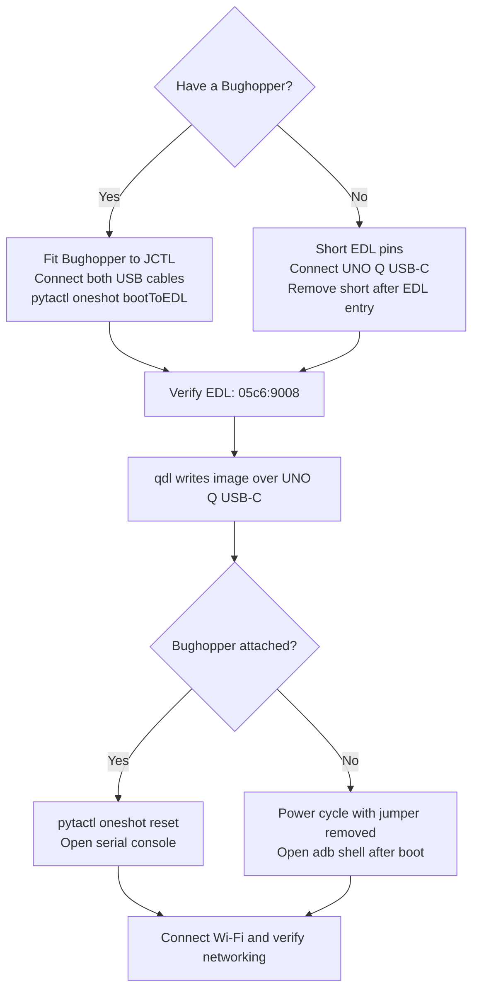

# Flash UNO Q and Connect to the Board

[Guide overview](README.md) · [Previous: Build the image](build.md) · **Part 2 of 4**

Complete [the image build](build.md) first.
On your local x86-64 Linux® computer, open a Bash shell in the guide directory and set `GUIDE_DIR` to its absolute path.
Confirm that `workspace/unoq-os1-flash.tar.gz` and `workspace/releases/1/ostree_repo` are available there.

Choose Bughopper serial access or Android Debug Bridge (ADB), then connect Arduino® UNO Q to your network.
The board will run Qualcomm® Linux® (QLI) after flashing.

> **Validation status:** Source-reviewed draft. The complete build and hardware walkthrough remain pending.
> See [sources and validation](validation.md).

- [Prepare the equipment and flashing tools](#prepare-the-equipment-and-flashing-tools)
- [Flash the UNO Q and open a shell](#flash-the-uno-q-and-open-a-shell)

## Prepare the Equipment and Flashing Tools

You need an UNO Q, a USB-C data cable, and a network the board can join.
For Bughopper boot control and serial access, add a Bughopper and a second USB data cable.
Without a Bughopper, keep a jumper cap or female-to-female jumper available for Emergency Download (EDL) mode.

Download [`qdl` v2.8](https://github.com/linux-msm/qdl/releases/tag/v2.8)
for Linux x86-64, extract it, and add its directory to `PATH`.
Keep the supporting files from the `qdl` archive together.

Install the console tool for your chosen connection:

- **With a Bughopper:** Install the boot-control and serial tools described below. ADB is optional for this path.
- **Without a Bughopper:** Install ADB. On Ubuntu, run `sudo apt install adb usbutils`.

Both paths use `qdl` and the UNO Q's own USB-C port for flashing.
Bughopper controls EDL entry and reset; `qdl` transfers the image.

### Install Bughopper Tools

For the Bughopper path, install [`pytactl` 2.0.0](https://github.com/qualcomm/pytactl/tree/6ee43578f983487821ade4feebebad94198da622).
It requires Python 3.10 or newer and supports Bughopper V1 and V2 without extra configuration files.
Run these commands on the **local Linux host**. On Ubuntu:

```bash
sudo apt update
sudo apt install pipx picocom usbutils libusb-1.0-0 libhidapi-hidraw0 libhidapi-libusb0
pipx install 'pytactl==2.0.0'
export PATH="$HOME/.local/bin:$PATH"
pytactl --help
```

The native libraries provide USB and Human Interface Device (HID) access.
Install these Bughopper USB permissions rules before connecting the hardware:

```bash
sudo tee /etc/udev/rules.d/60-bughopper.rules > /dev/null <<'EOF'
SUBSYSTEM=="usb", ATTRS{idVendor}=="0403", ATTRS{idProduct}=="6015", MODE="0660", GROUP="plugdev", TAG+="uaccess"
SUBSYSTEM=="hidraw", ATTRS{idVendor}=="2341", ATTRS{idProduct}=="b001", MODE="0660", GROUP="plugdev", TAG+="uaccess"
EOF
sudo udevadm control --reload-rules
sudo udevadm trigger
```

These rules cover Bughopper V1 USB control and V2 HID control, using the
[upstream device permissions](https://github.com/qualcomm/pytactl/blob/4c47a6172e3ee6fabc16fb8b7042004ec9cd140f/60-pytactl.rules).
They grant access to the active local session and the `plugdev` group.
For a remote host session, ask your administrator to provide the required device access.
If the Bughopper was already connected, reconnect it after installing the rules.
Serial-console permissions are described below.

## Flash the UNO Q and Open a Shell

> **Flashing replaces the board's Linux installation and stored data.** Save anything you need before proceeding.
> This installs the QLI image from the build page; Arduino App Lab workflows are outside this guide.

### Choose Your Console Connection



#### With a Bughopper

With power disconnected, align the Bughopper with the UNO Q's `JCTL` header as shown in
[Arduino's Bughopper manual](https://docs.arduino.cc/tutorials/bughopper/user-manual/).
Connect its USB port to the computer, and connect the UNO Q's own USB-C port separately for flashing and power.


*Hardware illustration: Arduino documentation. Use the linked manual for connector orientation.*

Open the Bughopper serial port at **115200 baud, 8 data bits, no parity, 1 stop bit, no flow control**.

Identify the Bughopper port under `/dev/serial/by-id/` and open it with
`picocom -b 115200 /dev/serial/by-id/<your-port>`.
Your account may need membership in the serial device's group, normally `dialout`.
Log out and back in after changing group membership.

After flashing, this console displays boot output and provides a Linux shell.
The supplied development configuration enables root serial autologin.

#### Without a Bughopper

The build configuration explicitly enables `image-adbd` and `enable-adbd`.
Keep the UNO Q's USB-C data cable connected after flashing.
After QLI boots, use ADB to open a shell as described below.
ADB becomes available after Linux starts; a Bughopper can also show earlier boot output.

### Enter EDL Mode

Choose the procedure for your connection, then verify EDL enumeration before flashing.

#### Enter EDL With Bughopper

Keep the Bughopper attached to `JCTL`, with its USB cable connected to the host.
Keep the UNO Q powered through its own USB-C connection to the same host.
Run the following in a **host terminal**, separate from the board's serial console:

```bash
pytactl list
```

Find the Bughopper entry and copy its USB serial number from `serial=...`.
Set `BUGHOPPER_SERIAL` to that value and retain it for the reset step:

```bash
export BUGHOPPER_SERIAL='PASTE_BUGHOPPER_SERIAL'
pytactl oneshot bootToEDL --serial "$BUGHOPPER_SERIAL"
```

`--serial` identifies the Bughopper USB device; it is separate from the UNO Q's ADB identifier and serial-port path.
The command cycles board power and asserts EDL through Bughopper.
Keep both USB cables connected throughout EDL entry and flashing.

#### Enter EDL With a Jumper

Use this procedure when flashing without a Bughopper.

Follow Arduino's [UNO Q EDL procedure](https://docs.arduino.cc/software/app-lab/configure/flash/#step-1-set-your-board-to-edl-mode).
Disconnect board power and short the designated EDL pins.
Then connect the UNO Q USB-C port to your computer.
Remove the short once the board has entered EDL.


*EDL illustration: Arduino documentation. Follow the marked pins rather than shorting an unidentified header pair.*

#### Verify EDL Enumeration

For either procedure, check for the EDL USB device on the host:

```bash
lsusb -d 05c6:9008
```

`qdl` must have USB access; consult its [host instructions](https://github.com/linux-msm/qdl/blob/v2.8/README.md)
if it cannot open the device.

### Write the Image

On the **local computer**, extract the flash archive:

```bash
mkdir -p "$GUIDE_DIR/workspace/flash-os1"
tar -xzf "$GUIDE_DIR/workspace/unoq-os1-flash.tar.gz" \
  -C "$GUIDE_DIR/workspace/flash-os1"
```

```bash
cd "$GUIDE_DIR/workspace/flash-os1/core-image-full-cmdline-uno-q.rootfs.qcomflash"
qdl --storage emmc --debug prog_firehose_ddr.elf rawprogram0.xml patch0.xml
```

Use the [Arduino USB permissions setup](https://docs.arduino.cc/software/app-lab/setup/linux/)
if `qdl` reports insufficient permissions.

Wait for `qdl` to complete successfully before resetting or disconnecting the board.

### Return to Normal Boot

**With Bughopper**, run this in the host terminal where you set `BUGHOPPER_SERIAL`:

```bash
pytactl oneshot reset --serial "$BUGHOPPER_SERIAL"
```

The reset command clears the EDL assertion and cycles board power for normal boot.
Keep both USB cables connected and observe the serial console.

**With a jumper**, disconnect board power, remove the EDL short if it is still connected,
and reconnect the board for normal boot.

### Open the QLI Shell and Connect Wi-Fi

With a Bughopper, use the serial shell.
Without one, run these commands on the host after the board finishes booting:

```bash
adb devices
adb root
adb shell
```

If more than one ADB device appears, add `-s <serial>` to each command.

Run the following **on the UNO Q**, as root:

```bash
cat /etc/os-release
command -v fio-device-register
command -v aktualizr-lite
docker version
nmcli device wifi rescan
nmcli device wifi list
nmcli --ask device wifi connect "YOUR_WIFI_SSID"
ip -4 address
ip route
date -u
```

Enter the Wi-Fi password when prompted.
Record the board's local-network IP address as `UNOQ_DEVICE_IP` on your computer.
Confirm that `/etc/os-release` identifies Qualcomm Linux and `BUILD_ID="unoq-wrynose-os-1"`.
Check that the board's clock is correct before enrolling it.

**Next:** [Set up the server and register UNO Q](server-registration.md).
Keep the guide directory, OS repository, lockfile, and Linux build environment for the later update exercises.
